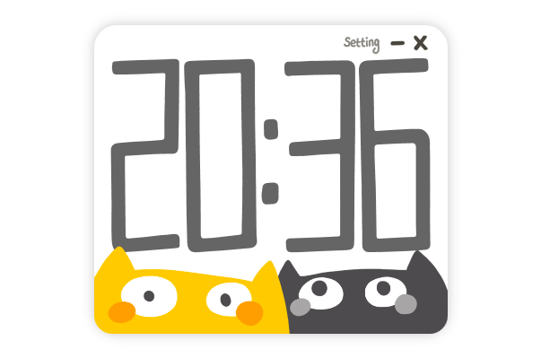

# Easy Cat Timer

Easy Cat Timer是一个非常简单计时器（倒计时）软件。

（[Please click here for the English document.](README[EN].md)）

 

 

## 下载

2019年7月2日之后，你可以在Steam商店里，下载这款软件。

 

最新版本：  v1.0.1.1 (2019年09月13日)

下载地址：[点击下载v1.0.1.1版本](https://github.com/xujiangjiang/Easy-Cat-Timer/releases/download/v1.0.1.1/Easy.Cat.Timer.v1.0.1.1.zip)

Steam地址：https://store.steampowered.com/app/1054580/Easy_Cat_Timer/

 

 

## 特色

Easy Cat Timer是一个使用C#语言编写的WPF应用（.NET Framework），可运行在Windows平台。

 

**软件特色：**

- 非常简单（只有倒计时的功能）
- 非常可爱
- 有详细的中文注释

 

**在这个简单的项目中，大概有这些部分：**

| 名字           | 描述                                                         |
| -------------- | ------------------------------------------------------------ |
| 定时器         | 在.Net中，如何完成一个计时功能？                             |
| 动画           | 在项目中，用到了2种不同的动画书写方式。 一种是直接在C#代码里书写，一种是在XAML里书写。 |
| 数据绑定       | 把数据类绑定在XAML中，并且进行双向数据同步。                 |
| 字体           | 如何在WPF中，使用非系统内嵌的字体。                          |
| 通知窗口       | 如何在屏幕右下角弹出自定义的通知窗口。 这一部分参考了这位大大的代码： https://blog.csdn.net/catshitone/article/details/75089069 但是我不是用的窗口位移，而是让窗口里的元素位移。 窗口位移只适用于使用单个显示器的情况，如果用户是双显示器可能会看出瑕疵：） |
| 保存和读取     | 在WPF里，用WPF自带的Settings.settings实现保存和加载功能（存档功能）。 |
| 不同形状的窗口 | 如何制作奇形怪状的窗口？ 在这个软件中有2个窗口（主窗口、通知窗口）， 主窗口是带有圆角的方形，通知窗口是异形（不规则的形状）的。 |

 

 

## 项目结构

**文件夹说明：**

| 文件夹      | 描述                                                         |
| ----------- | ------------------------------------------------------------ |
| Asset       | 这个文件夹里，是项目中用到的所有资源。 包括了图片 、字体和声音文件。 |
| Code        | 这个文件夹里，是项目中用到的所有C#脚本。                     |
| Xaml        | 这个文件夹里，是项目中用到的所有.xaml文件。 包括了自定义控件、资源词典、以及样式。 |
| ReadMeIamge | 这个文件夹里，装的是README.md文档中要用到的图片。 （直接删掉也没关系哒！~） |

 

**重要文件说明：**

| 文件                    | 描述                                                 |
| ----------------------- | ---------------------------------------------------- |
| MainWindow.xaml         | 主界面                                               |
| NotificationWindow.xaml | 通知界面                                             |
| AppManager.cs           | 管理类  (用于管理所有的窗口、逻辑、以及数据类的对象) |
| TimeSystem.cs           | 计时器功能                                           |
| SaveSystem.cs           | 保存加载功能                                         |
| LanguageSystem.cs       | 多语言功能                                           |
| AudioSystem.cs          | 音效功能                                             |

 

 

## 更新日志

**v0.0.1.1（2019.06.25）：**

1. 优化[任务栏进度条]（完成时闪烁、暂停时变红）
2. 把Staff面板放到窗口外
3. 修复：有时候倒计时完成，没有声音（怀疑是声音文件被系统[垃圾回收]了）
4. 现在，当鼠标进入Staff面板时，会显示Staff面板。（这是为了防止：当Staff面板在屏幕边缘出现时，Staff面板疯狂闪烁）
5. 现在，文本框里不能输入“-”、“.”字符

 

**v1.0.0.0（2019.07.01）：**

1. 优化：在设置分钟数和秒钟数时，如果一直按住按钮，可以一直增加(或减少)分钟数(或者秒钟数)  *——感谢：Felix*
2. 修复：在设置时间时，在文本框里滚动鼠标滚轮，会导致数字发生滚动  *——感谢：Felix、小木*
3. 优化：在设置时间时，如果秒钟数为0，此时如果再次减少秒钟数，秒钟数会变为59。分钟数同理。  *——感谢：Felix*
4. 优化：把Timer类 改为 wpf自带的DispatcherTimer类
5. 优化：在设置时间的界面，按回车就可以开始计时  *——感谢：小木*
6. 修复：现在鼠标右键点击任何按钮 都无效（只有鼠标左键可以点击按钮）

 

**v1.0.1.0（2019.07.30）：**

1. 优化：在设置时间的时候，可以通过滚动鼠标中键来调整时间——*感谢：小木*
  2. 优化：可以调节音量——*感谢：[TBR] Flaming、乐乐*

 

**v1.0.1.1（2019.09.13）：**

1. 修复Bug：长按“秒”的上箭头时，秒数会减少（代码写反了）——感谢：UEMion
2. 优化：重做了[音量]功能（使用SoundPlayer类）——感谢：amirrammari

